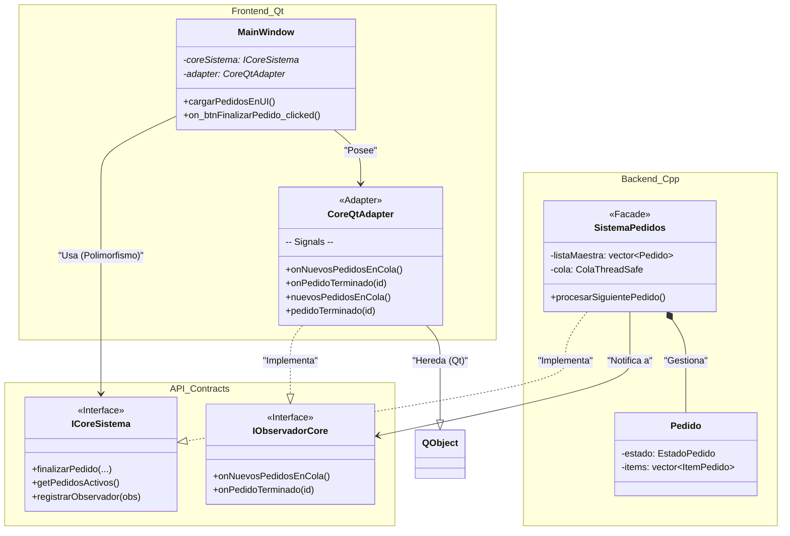

### Diagrama de Clases "Full-Stack" (Core + UI Integration)

```mermaid
classDiagram
    direction TB

    %% --- CAPA DE UI (QT) ---
    namespace Frontend_Qt {
        class MainWindow {
            -coreSistema: ICoreSistema*
            -adapter: CoreQtAdapter*
            +cargarPedidosEnUI()
            +on_btnFinalizarPedido_clicked()
        }

        class CoreQtAdapter {
            <<Adapter>>
            +onNuevosPedidosEnCola()
            +onPedidoTerminado(id)
            -- Signals --
            +nuevosPedidosEnCola()
            +pedidoTerminado(id)
        }
    }

    %% --- CAPA DE CONTRATOS (INTERFACES) ---
    namespace API_Contracts {
        class ICoreSistema {
            <<Interface>>
            +finalizarPedido(...)
            +getPedidosActivos()
            +registrarObservador(obs)
        }

        class IObservadorCore {
            <<Interface>>
            +onNuevosPedidosEnCola()
            +onPedidoTerminado(id)
        }
    }

    %% --- CAPA DE CORE (C++ PURO) ---
    namespace Backend_Cpp {
        class SistemaPedidos {
            <<Facade>>
            -listaMaestra: vector~Pedido~
            -cola: ColaThreadSafe
            +procesarSiguientePedido()
        }

        class Pedido {
            -estado: EstadoPedido
            -items: vector~ItemPedido~
        }
    }

    %% RELACIONES
    MainWindow --> ICoreSistema : "Usa (Polimorfismo)"
    MainWindow --> CoreQtAdapter : "Posee"

    SistemaPedidos ..|> ICoreSistema : "Implementa"
    CoreQtAdapter ..|> IObservadorCore : "Implementa"
    CoreQtAdapter --|> QObject : "Hereda (Qt)"

    SistemaPedidos --> IObservadorCore : "Notifica a"
    SistemaPedidos *-- Pedido : "Gestiona"
```
