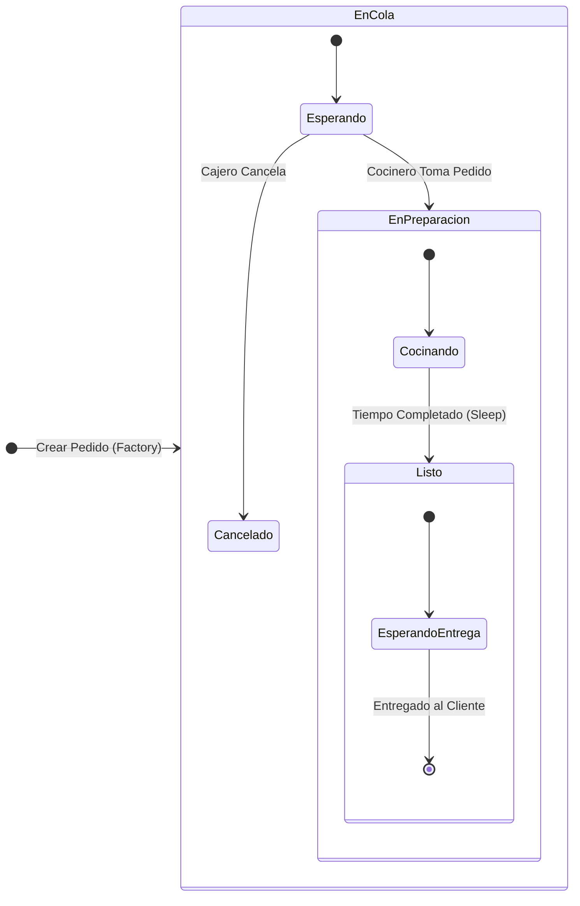

### Diagrama de Estados del Pedido (State Machine)

```mermaid
stateDiagram-v2
    direction LR
    
    %% Estado Inicial
    [*] --> EnCola : Crear Pedido (Factory)

    %% Estado: EN COLA
    state EnCola {
        [*] --> Esperando
        Esperando --> Cancelado : Cajero Cancela
        Esperando --> EnPreparacion : Cocinero Toma Pedido
    }

    %% Estado: EN PREPARACION
    state EnPreparacion {
        %% Regla de Negocio: Aquí ya NO se puede cancelar
        [*] --> Cocinando
        Cocinando --> Listo : Tiempo Completado (Sleep)
    }

    %% Estado: LISTO
    state Listo {
        [*] --> EsperandoEntrega
        EsperandoEntrega --> [*] : Entregado al Cliente
    }

    %% Estilos visuales
    class EnCola,EnPreparacion,Listo active
```
