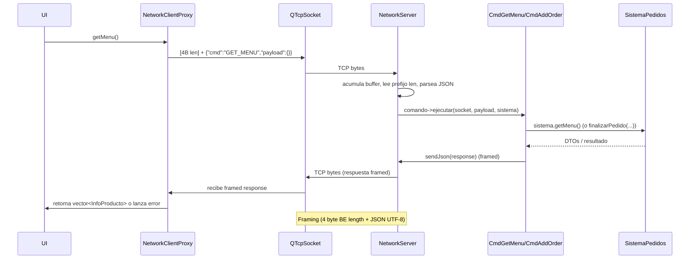

# Diagrama de la capa de red (Network)

Este documento explica de forma concisa cómo está diseñada la capa de red del proyecto: qué hace el servidor (`NetworkServer`), cómo despacha comandos (pattern Command), y cómo el cliente (`NetworkClientProxy`) actúa como proxy remoto del núcleo local. Está pensado para un desarrollador que no haya visto el proyecto antes.

---

## Componentes principales 🔧

- **NetworkServer (server/)**

  - Clase: `NetworkServer` (hereda de `QTcpServer`).
  - Recibe conexiones TCP, mantiene una tabla de comandos y despacha peticiones entrantes a implementaciones de `IComandoServidor`.
  - Archivos relevantes:
    - `server/include/NetworkServer.h`
    - `server/src/NetworkServer.cpp`

- **IComandoServidor**

  - Interfaz que define `virtual void ejecutar(QTcpSocket *clientSocket, const QJsonObject &payload, SistemaPedidos &sistema) = 0;`.
  - Cada comando concreto (por ejemplo `CmdGetMenu`, `CmdAddOrder`) implementa esta interfaz para manejar una petición específica.
  - Archivos relevantes:
    - `server/include/IComandoServidor.h`

- **Comandos (pattern Command)**

  - `CmdGetMenu` → lee menú desde `SistemaPedidos`, serializa y responde.
  - `CmdAddOrder` → deserializa payload, llama a `SistemaPedidos::finalizarPedido(...)` y responde OK/ERROR.
  - Archivos: `server/include/CmdGetMenu.h`, `server/src/CmdGetMenu.cpp`, `server/include/CmdAddOrder.h`, `server/src/CmdAddOrder.cpp`.

- **NetworkClientProxy (client/)**

  - Implementa la interfaz `ICoreSistema` que usa la UI. Internamente se comunica por TCP con `NetworkServer`.
  - Realiza peticiones JSON framed (ver más abajo), espera la respuesta, y convierte JSON → DTOs (por ejemplo `InfoProducto`).
  - Archivos: `client/src/NetworkClientProxy.h`, `client/src/NetworkClientProxy.cpp`.

- **Helpers de protocolo (framing)**
  - `NetworkProtocol::sendJson(...)` (en server y client): añade un prefijo de 4 bytes (big-endian) con la longitud del payload JSON y luego el payload en UTF-8.
  - Esto evita los problemas de "sticky packets" del transporte TCP.

---

## Flujo de una petición (secuencia) 🔁

1. La UI llama a un método del núcleo (ej. `getMenu()` o `finalizarPedido(...)`) que, cuando se usa el modo remoto, está implementado por `NetworkClientProxy`.
2. `NetworkClientProxy` construye el objeto JSON de request: `{ "cmd": "CMD_NAME", "payload": { ... } }`.
3. Envía el mensaje usando framing: 4 bytes BE con la longitud del JSON, seguido del JSON en UTF-8 (helper `NetworkProtocol::sendJson`).
4. `NetworkServer` (por socket de cliente) recibe bytes, su `readyRead` acumula en un buffer por socket y procesa mensajes completos leyendo primero la longitud, luego el body JSON.
5. `NetworkServer` parsea JSON, extrae la clave `cmd` y busca el comando en su mapa: `std::map<QString, std::shared_ptr<IComandoServidor>> comandos`.
6. Si el comando existe, el servidor llama `comando->ejecutar(socket, payload, sistema)` e **inmediatamente** el comando puede enviar la respuesta por el mismo socket (también framed).
7. `NetworkClientProxy` lee la respuesta framed, valida `status` y deserializa `data` a los DTOs que espera el UI.

---

## Formato de mensajes JSON 📑

- **Request GET_MENU**

  - Request:
    ```json
    { "cmd": "GET_MENU", "payload": {} }
    ```
  - Response (ejemplo):
    ```json
    {
      "status": "OK",
      "data": [ { "id": 1, "nombre": "Cafe", "precio": 5.5 }, ... ]
    }
    ```

- **Request ADD_ORDER**
  - Request payload esperado:
    ```json
    {
      "cmd": "ADD_ORDER",
      "payload": {
        "cliente": "Nombre",
        "id_descuento": "nulo",
        "items": [ { "productoId": 1, "cantidad": 2 }, ... ]
      }
    }
    ```
  - Response: `{"status":"OK","message":"Pedido recibido"}` o `{"status":"ERROR","message":"..."}`

Las claves del protocolo (ej: `KEY_CMD`, `KEY_PAYLOAD`, `KEY_STATUS`, `KEY_MSG`, `KEY_DATA`) están definidas en `common/include/api/Protocolo.h` para mantener coherencia cliente/servidor.

---

## Manejo de errores y robustez ⚠️

- Framing: el prefijo de longitud evita problemas de mensajes concatenados o incompletos en TCP.
- El servidor valida la estructura del JSON y responde con `status: "ERROR"` + `message` en caso de payload inválido.
- El cliente (proxy) lanza excepciones (`std::runtime_error`) en casos como: no conectado, timeout esperando respuesta, JSON malformado o `status != "OK"`.
- Recomendación futura: convertir las operaciones del proxy a asíncronas (signals/slots / promises) para no bloquear la UI y añadir reconexión automática.

---

## Cómo agregar un nuevo comando (pasos rápidos) ➕

1. Crear la clase comando en `server/include/` y `server/src/` que herede `IComandoServidor` y implemente `ejecutar(...)`.
2. Registrar el comando en el constructor de `NetworkServer` con la clave `Protocolo::CMD_...`.
3. Añadir en `NetworkClientProxy` un método que construya el JSON `cmd`/`payload`, use `enviarRequestYEsperarRespuesta()` y mapee la respuesta a DTOs.

---

## Notas finales 💡

- Arquitectura: el patrón Command desacopla el parsing / transporte (NetworkServer) de la lógica de negocio (comandos + SistemaPedidos), facil de probar y extender.
- Las funciones de utilidad para framing están duplicadas en `server/include/NetworkProtocol.h` y `client/src/NetworkProtocol.h`. Tal vez para un mayor DRY, se moverá el helper a `common/` para compartir código.

---

## Diagrama de secuencia (Mermaid) 🧭

El siguiente diagrama muestra una petición típica (ej: `GET_MENU`) y la respuesta, incluyendo el framing (prefijo de 4 bytes con la longitud):


