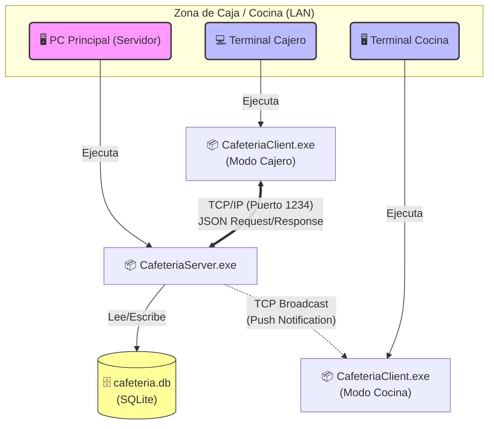

```mermaid
graph TD
    %% Estilos para que se vea bonito
    classDef server fill:#f9f,stroke:#333,stroke-width:2px;
    classDef client fill:#bbf,stroke:#333,stroke-width:2px;
    classDef db fill:#ff9,stroke:#333,stroke-width:1px;

    subgraph "Zona de Caja / Cocina (LAN)"
        direction TB
        
        nodeServer("🖥️ PC Principal (Servidor)"):::server
        nodeCajero("💻 Terminal Cajero"):::client
        nodeCocina("🖥️ Terminal Cocina"):::client
    end

    %% Artefactos dentro del Servidor
    nodeServer -- "Ejecuta" --> artifactServer["📦 CafeteriaServer.exe"]
    artifactServer -- "Lee/Escribe" --> artifactDB[("🗄️ cafeteria.db\n(SQLite)")]:::db
    
    %% Artefactos Clientes
    nodeCajero -- "Ejecuta" --> artifactClient1["📦 CafeteriaClient.exe\n(Modo Cajero)"]
    nodeCocina -- "Ejecuta" --> artifactClient2["📦 CafeteriaClient.exe\n(Modo Cocina)"]

    %% Conexiones de Red
    artifactClient1 <== "TCP/IP (Puerto 1234)\nJSON Request/Response" ==> artifactServer
    artifactServer -. "TCP Broadcast\n(Push Notification)" .-> artifactClient2
```