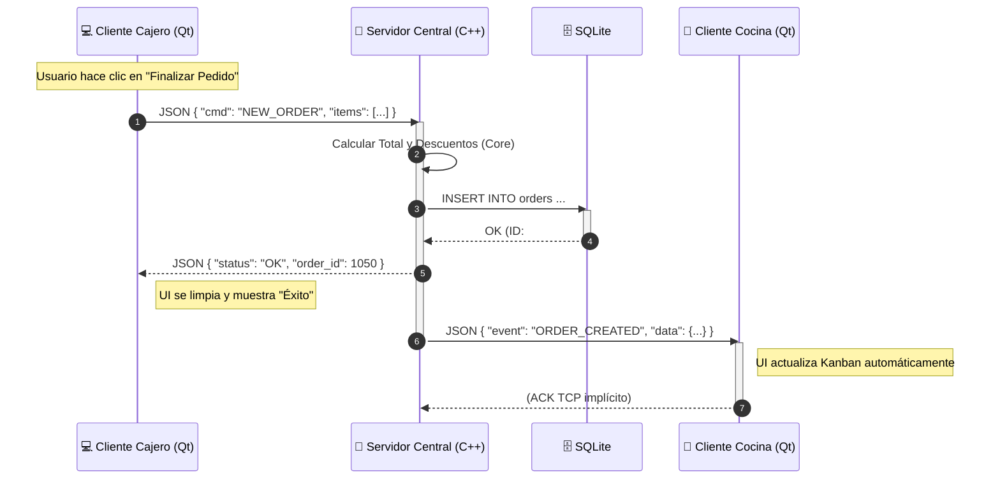

```mermaid
sequenceDiagram
    autonumber
    participant Cajero as 💻 Cliente Cajero (Qt)
    participant Server as 🧠 Servidor Central (C++)
    participant DB as 🗄️ SQLite
    participant Cocina as 🍳 Cliente Cocina (Qt)

    note over Cajero: Usuario hace clic en "Finalizar Pedido"

    %% 1. Petición
    Cajero->>Server: JSON { "cmd": "NEW_ORDER", "items": [...] }
    activate Server

    %% 2. Procesamiento Central
    Server->>Server: Calcular Total y Descuentos (Core)
    Server->>DB: INSERT INTO orders ...
    activate DB
    DB-->>Server: OK (ID: #1050)
    deactivate DB

    %% 3. Respuesta al Cajero (ACK)
    Server-->>Cajero: JSON { "status": "OK", "order_id": 1050 }
    note right of Cajero: UI se limpia y muestra "Éxito"

    %% 4. Notificación Push (Broadcast)
    Server->>Cocina: JSON { "event": "ORDER_CREATED", "data": {...} }
    deactivate Server
    
    activate Cocina
    note right of Cocina: UI actualiza Kanban automáticamente
    Cocina-->>Server: (ACK TCP implícito)
    deactivate Cocina
```