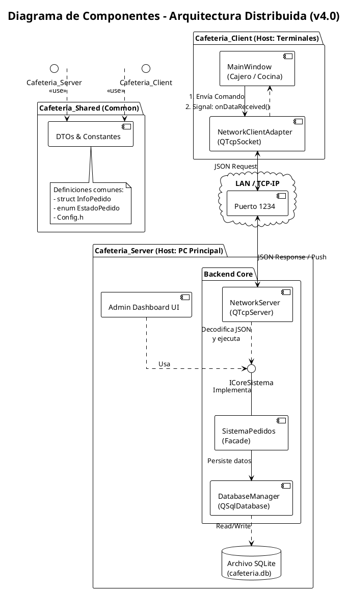

```plantuml
@startuml
!theme plain
skinparam componentStyle uml2
skinparam linetype ortho
skinparam nodesep 60
skinparam ranksep 60

title Diagrama de Componentes - Arquitectura Distribuida (v4.0)

package "Cafeteria_Shared (Common)" {
    [DTOs & Constantes] as Shared
    note bottom of Shared
        Definiciones comunes:
        - struct InfoPedido
        - enum EstadoPedido
        - Config.h
    end note
}

package "Cafeteria_Server (Host: PC Principal)" {
    
    component [Admin Dashboard UI] as AdminUI
    
    package "Backend Core" {
        component [NetworkServer\n(QTcpServer)] as NetServer
        component [SistemaPedidos\n(Facade)] as Core
        component [DatabaseManager\n(QSqlDatabase)] as DB
        
        interface "ICoreSistema" as ICore
    }
    
    database "Archivo SQLite\n(cafeteria.db)" as SQLite

    ' Relaciones Internas Server
    AdminUI ..> ICore : Usa
    NetServer ..> ICore : Decodifica JSON\ny ejecuta
    ICore -- Core : Implementa
    Core --> DB : Persiste datos
    DB ..> SQLite : Read/Write
}

package "Cafeteria_Client (Host: Terminales)" {
    component [MainWindow\n(Cajero / Cocina)] as ClientUI
    component [NetworkClientAdapter\n(QTcpSocket)] as NetClient
    
    ' Relaciones Internas Client
    ClientUI --> NetClient : "1. Envía Comando"
    NetClient ..> ClientUI : "2. Signal: onDataReceived()"
}

' Relaciones entre Paquetes (Dependencias de código)
Cafeteria_Server ..> Shared : <<use>>
Cafeteria_Client ..> Shared : <<use>>

' Relación de Red (Runtime)
cloud "LAN / TCP-IP" {
    [Puerto 1234] as Port
}

NetClient <--> Port : JSON Request
Port <--> NetServer : JSON Response / Push

@enduml
```